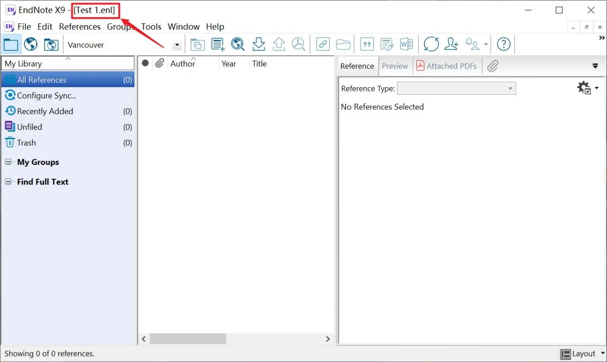

# 软件介绍

EndNote是一款功能齐全的文献管理工。目前网络上流传较广的是中科大和国科大正版的批量授权软件。本文提供中科大英文版的EndNote X9.3.3。

# 下载地址

链接：<https://pan.baidu.com/s/1sOMlmL0-fmpyPg1p9cZm-g?pwd=jp36>

提取码：jp36

# 安装步骤

1.  **安装前请关闭Microsoft Office系列软件**；如果之前安装了EndNote旧版本，**需先卸载旧版本再安装**。

2.  下载安装包，解压后如下所示。

3.  鼠标右键，以管理员身份运行 **EndNote X9.3.3 中科大英文版.exe**。

4.  点击 *Next*。

5.  点击 *Accept*。

6.  点击 *Next*。

7.  接受协议，点击 *Next*。

8.  选择 *Typical*，点击 *Next*。

9.  点击 *Browser...*，选择安装目录，如：`E:\Program Files (x86)\EndNote X9`。注意安装目录名不要出现中文。随后点击 *Next*。

10. 点击 *Next*。

11. 等待安装结束。

12. 安装完成，点击 *Finish*。

13. 打开桌面新创建的快捷方式，会发现该软件一片灰色。这是因为新安装的软件没有一个文献库，没打开文献库的原因。这里依次点击 File - New...。

14. 选择一个目录（任意位置），创建文献库。如建立一个名称为 *Test 1* 的文献库，其类型为 *enl*。点击 *保存*。

15. 观察刚才创建的文献库 *Test 1* 的目录，发现创建了两个与其对应的数据：①为文献库 *Test 1.enl*，②为与该文献库匹配的数据文件夹 *Test 1.Data*。这两者是一个整体，缺少任何一个，软件将无法打开 *Test 1* 这个文献库。

16. 创建完毕后，软件会自动打开该文献库。EndNote可同时管理多个不同的文献库，并自由切换。

17. 打开Word，观察EndNote X9是否集成在加载中心。若Word加载栏没有显示EndNote X9加载项，可手动在Word里选择加载。

18. 安装完成，压缩包里附有Endnote X9的使用教程，如有需要可参考。

# 参考

安装教程参考：[EndNote X9.3.3 安装使用](https://mp.weixin.qq.com/s/iEv_JcwFVKLC-SQXF9zw_w/ "EndNote X9.3.3 安装使用")

EndNote X9使用教程pdf：[手把手教你使用 EndNote X9](https://github.com/wanzhenchn/EndNote_Tutorial_Hand_by_Hand/ "wanzhenchn/EndNote_Tutorial_Hand_by_Hand")
