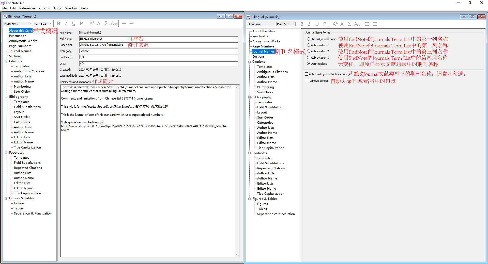
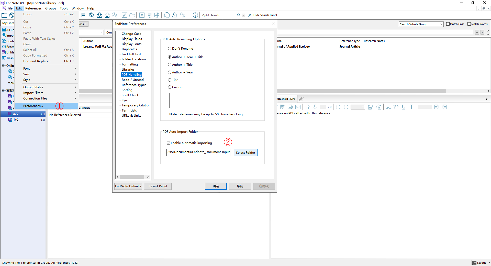
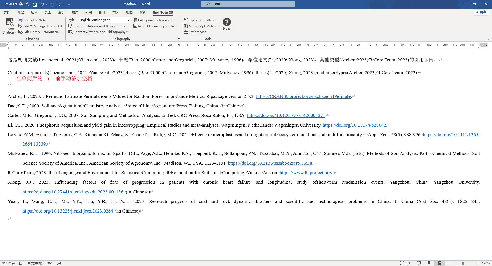

本文主要介绍中文文献（期刊、书籍、学位论文等）的 EndNote 管理方式及其双语引用。同时提供多种基于 EndNote 的参考文献类型文件（xml文件）、文献导入过滤器文件（enf文件）和导出样式文件（ens文件）。

# 安装EndNote

参考 [相关教程](EndNote安装教程.md/ "EndNote X9.3.3 安装教程")，安装 **EndNote X9.3.3 中科大英文版.exe**。

链接：<https://pan.baidu.com/s/1sOMlmL0-fmpyPg1p9cZm-g?pwd=jp36>

提取码：jp36

# 参考文献类型 Reference Types

建立专用于中文文献（期刊、书籍、学位论文）的参考文献类型：Chinese Journal, Chinese Book, Chinese Thesis。下面，提供建立中文参考文献类型的两种方式。

## 自定义建立

利用 EndNote 内置的三个未使用的参考文献类型，手动修改字段，建立参考文献类型。

依次点击 Edit - Preference - Reference Types - Modify Reference Types。查看 Reference Type 下拉菜单，可以发现有三个未使用的类型。

参照 Journal, Book, Thesis 的样式，将三个未使用类型的空白字段分别完善，并命名为 Chinese Journal, Chinese Book, Chinese Thesis，如下：

其中，红色框选的为修改项，其余的字段与 Journal, Book, Thesis 原类型字段保持一致。

## 导入已建立的参考文献类型

依次点击 Edit - Preference - Reference Types - Import，选中并打开 [ReferenceType_ChineseArticle.xml](Shared/ReferenceType_ChineseArticle.xml)。该文件即已包含按上述规则建立的 Chinese Journal, Chinese Book, Chinese Thesis 三种类型。

# 文献导出样式 Output Styles

## 官网样式

[EndNote官网](https://endnote.com/downloads/styles/ "Output styles - EndNote") 提供7000+文献导出样式，可手动下载，再将样式文件（**ens文件**）转移至 EndNote 安装目录的 Styles 文件夹内。

## 自定义文献导出样式

本文附有 [多种自定义参考文献导出格式](Shared/ "多种自定义文献导出样式ens文件")，可供选择、下载与使用。

此外，可以新建样式编辑，依次点击 Edit - Output Styles - Open Style Manager，右键某一样式，点击 Edit Style 进行编辑。

建议在已有的样式基础上进行部分参数的修改。以自定义的适用于中文文稿撰写的顺序编码制参考文献中英文对照样式 [*Bilingual (Numeric).ens*](Shared/Bilingual%20(Numeric).ens) 为例，介绍编辑界面及常用的修改参数如下：

# 连接文件 Conection Files

EndNote 可以检索在线数据库，并把检索结果导入到 EndNote 本地数据库中，这个过程就是 EndNote 的连接文件（Conection Files）在起作用。每一个连接文件对应一个在线数据库。

[EndNote官网](https://endnote.com/downloads/connections/ "Connection files - EndNote") 提供3000+连接文件，可手动下载，再将连接文件（**enz文件**）转移至 EndNote 安装目录的 Connections 文件夹内。此处，本文建议保留 [*CrossRef.enz*](https://endnote.com/downloads/connections/pila/ "PILA - EndNote") 和 [*Web of Science Core Collection (Clarivate).enz*](https://endnote.com/downloads/connections/web-of-science-core-collection-clarivate-analytics/ "Web of Science Core Collection (Clarivate) - EndNote") 这两个连接文件。

事实上，**EndNote连接文件对中文文献的支持十分有限**，这更适用于英文文献。

## 在线检索

在 EndNote 中，利用连接文件进行在线检索。

依次点击 Edit - Connection Files - Open Connection Manager，勾选连接文件。

之后，在侧边栏选择相关数据库，进行在线检索。

## 文献题录信息自动更新

文献条目（可多选）上右键，点击 Find Reference Updates。

应注意，利用 *Web of Science Core Collection (Clarivate).enz*（WOS）进行检索或更新的题录信息比较全面，只是作者名字默认为缩写。利用 *CrossRef.enz*（DOI）进行检索或更新中的作者默认为全名。

本文提供一种通过自动更新尽量补全题录信息并使作者姓名显示完整的思路：

-   在 EndNote 安装目录的 Connections 文件夹中，将 WOS、DOI 连接文件移出并暂存于其它文件夹（为方便查找，可暂存于桌面）。同时去除 Connections 文件夹内的所有 enz文件（可存于其它文件夹）。此时，EndNote 因缺少连接文件，无法在线检索或更新。

-   将 WOS 连接文件移回 Connections 文件夹内，将 EndNote 中的文献先通过 WOS 更新题录信息，得到相对完整的字段组。但此时的作者名字为字母缩写。

-   将 Connections 文件夹中的 WOS 连接文件替换为 DOI 连接文件。再次更新 EndNote 中的文献题录信息。DOI 数据库包含作者、年、标题、期刊名、卷、期、DOI、ISSN等，其中作者姓名为全称，从而可通过 Update All Fields 将已有题录信息覆盖。

# 文献导入过滤器 Import Filters

[EndNote官网](https://endnote.com/downloads/filters/ "Import filters - EndNote") 提供600+文献导入过滤器，可手动下载，再将过滤器文件（**enf文件**）转移至 EndNote 安装目录的 Filters 文件夹内。图中文件夹内所示的为常用的过滤器文件。

过滤器 [*ISI-CE.enf*](https://endnote.com/downloads/filters/isi-ce/ "ISI-CE - EndNote") 适用于由 [Web of Science](https://webofscience.clarivate.cn/wos/alldb/basic-search "Web of Science") 导出的参考文献信息ciw文件向 EndNote 的导入，但通过该过滤器导入的参考文献的作者名字默认为缩写。

可对 *ISI-CE.enf* 原文件做适当调整，或直接替换为 [调整后的现成的enf文件](Shared/ "调整后的ISI-CE.enf及原文件ISI-CE original.enf")，实现 Web of Science 数据库文献导入时作者姓名显示全称。

下面介绍如何对 *ISI-CE.enf* 原文件做适当调整：依次点击 Edit - Import Filters - Open Filter Manager，右键过滤器文件 *ISI-CE.enf*，点击 Edit Filter 进行编辑。

将保存的 *ISI-CE Copy.enf* （通常在 电脑/我的文档 内）转移至 EndNote 安装目录的 Filters 文件夹内，并更名为 *ISI-CE.enf* 使之成为默认过滤器文件。原文件可更名为 *ISI-CE original.enf* 以备份。

# 文献管理

## 中文文献

以 [知网](https://www.cnki.net/ "中国知网") 为例，演示中文期刊、学位论文等文献信息下载，文献信息导入 EndNote，中文文献题录信息调整等过程。

### 文献信息的下载

勾选文献后，依次点击 导出与分析 - 导出文献 - EndNote - 导出题录文件。

### 题录信息导入EndNote

在 EndNote 中，依次点击 File - Import - File，选中从知网导出的题录文件，将过滤器设为 *EndNote Import*，导入即可。

### 文献题录信息调整

**中文文献题录信息的调整规则。**首先指定参考文献类型Reference Type。中文的作者、标题、期刊、出版社、出版地、大学依次移入/填入 AuthorCN、TitleCN、JournalCN、PublisherCN、Place PublishedCN、UniverityCN 字段中，再从文献官方网站查取或自行翻译英文并填入相应的EN字段。

AuthorEN 字段，单词词首字母大写，将中文作者的姓名拼音按中文习惯补充空格。双击参考文献条目进入题录信息编辑页，可利用字体格式栏调整 TitleEN 字段的大小写、上下标等，除特定组合外，一般将期刊论文、学位论文、书籍/专著析出文章的标题句首字母大写，其余小写，将书籍/专著名的实义词首字母大写，其余小写。调整 JournalEN 字段，通常实义词首字母大写，中文期刊的英文名称可优先从 [知网](https://kns.cnki.net/knavi/journals/index?uniplatform=NZKPT/ "期刊导航 - 知网") 查取。年份、卷、页码等也应与论文的官网保持一致。出版社 PublisherEN 字段通常词首字母大写。书籍/专著的版本 Edition 字段以“2nd, 3rd, 4th, ...”的形式标注，第1版留空。Language 字段填入 `Chinese`，可分组批量操作。

-   新建文献题录

    以新建一个中文图书为例，选择好参考文献类型后，将字段尽量填充完整。其中，**书籍/图书/专著的版本Edition字段建议采用“2nd, 3rd, 4th, ...”的形式**，以与英文文献保持一致，第1版留空不标注。

    

-   更改题录信息

    以从知网导入的中文期刊为例，在文献题录区将**参考文献类型**更改，再将具体字段补充完整。

    

-   批量修改

    以批量修改文献 Language 字段为例。将计划批量修改题录信息的文献置于同一个分组中，选中该分组后，依次点击 Tools - Change/Move/Copy Fields，在批量修改窗口中，选中 Language 字段，填入 `Chinese`，确定。

    

## 英文文献

以 [Web of Science](https://webofscience.clarivate.cn/wos/woscc/basic-search "Web of Science") 为例，演示英文文献信息下载与导入 EndNote，题录信息调整等过程。

### 数据库文献信息下载并导入 EndNote

在 Web of Science 官网检索到文献后，勾选文献，Export - EndNote desktop，点击导出。

在 EndNote 中，依次点击 File - Import - File，选中从 Web of Science 导出的题录文件，将过滤器设为 *ISI-CE* 导入即可。

通过 Web of Science 导出/导入的文献题录比较丰富全面，但部分字段可能与原文存在出入。应在导入后随即进行题录信息的调整。

**英文文献题录信息的调整规则。**Author 字段，单词词首字母大写，将中文作者的姓名拼音按中文习惯补充空格，拉丁语国家作者的名字可能含有拉丁字母，应根据实际进行修订（可从论文发表详情页查阅），姓名中出现的冠词介词（如 de、van 等）通常保持小写。双击参考文献条目进入题录信息编辑页，可利用字体格式栏调整Title字段的大小写、上下标等，除特定组合外，一般将期刊论文、学位论文、书籍/专著析出文章的标题句首字母大写，其余小写，将书籍/专著名的实义词首字母大写，其余小写。调整 Journal 字段，将其与期刊官网名称及格式保持一致，通常实义词首字母大写。年份、卷、页码等也应与论文的官网保持一致。出版社 Publisher 字段通常词首字母大写。书籍/专著的版本 Edition 字段以“2nd, 3rd, 4th, ...”的形式标注，第1版留空。Language 字段填入 `English`，可分组批量操作。

### 在 EndNote 中在线检索

利用连接文件，可以在 EndNote 软件中直接进行文献的在线检索与转存，并可进行题录信息的自动更新。但该方法同样不可避免部分字段信息与原文可能存在出入，仍有必要进行校对与手动调整。

### 直接导入 PDF 文件

EndNote 可以识别 PDF 文件中的 DOI，进而通过连接文件 *CrossRef.enz* 检索并更新题录信息。因此，该方法**要求 PDF 中有 DOI，且 *CrossRef.enz* 应保持在 EndNote 安装目录的 Connections 文件夹内**。

依次点击 File - Import - File，选中 PDF 文件，将过滤器设为 *PDF*，导入。

或者，依次点击 Edit - Preferences - PDF Handling，设置PDF自动导入文件夹。然后，可以将多个 PDF 文件置于该文件夹内，EndNote 即可自动录入这些 PDF 文献。

# 期刊缩写 Term List

依次点击 Tools - Open Term Lists - Journals Term List，可以查看 EndNote 中定义的期刊缩写列表。

期刊缩写列表可以自行编辑、添加、删除，共有四列内容。第一列为全称 Full Journal，与文献题录中的期刊名 Journal对应，不区分大小写。第二至四列可填入不同规定的期刊缩写，从而可以根据参考文献导出样式中指定的期刊名格式展示。

以 [Journal Citation Reports](https://jcr.clarivate.com/ "Journal Citation Reports") 提供的期刊 ISO 缩写或 JCR 缩写为主要参考，进行 EndNote 期刊缩写列表的编辑。

可以将从 Journal Citation Reports 爬取的期刊缩写列表直接导入 EndNote 使用。首先删除 EndNote 中已有的 Journals Term List（建议在删除前先导出备份），再新建一个新的空白的 Journals Term List，然后导入爬取的 [期刊缩写信息txt文件](https://github.com/chugit/Crawler_Journal_Abbreviation/blob/main/Abbreviation_JCR.txt/ "Abbreviation_JCR.txt")（该文件于2024/3/9\~3/12从JCR网站爬取，包含21762个期刊的名称、ISO缩写和JCR缩写）。

中文期刊的英文名称可以从 [知网](https://kns.cnki.net/knavi/journals/index?uniplatform=NZKPT/ "期刊导航 - 知网") 查取，填入中文文献题录的 JournalEN 字段。中文期刊的英文缩写可通过 [CAS网站](https://cassi.cas.org/ "CAS Source Index (CASSI) Search Tool") 或 [ISSN题名词缩写表](https://www.issn.org/services/online-services/access-to-the-ltwa/ "Access to the LTWA | ISSN") 查取，再手动编入 EndNote 期刊缩写列表内。

# 自定义文献导出样式简介

本文附有 [多种自定义参考文献导出格式](Shared/ "多种自定义文献导出样式ens文件")，可供选择、下载。可将样式文件（**ens文件**）下载并转移至 EndNote 安装目录的 Styles 文件夹内使用。

## Bilingual (Numeric).ens

本格式文件为顺序编码制，改自 [*Chinese Std GBT7714 (numeric).ens*](https://endnote.com/downloads/styles/chinese-standard-gb-t7714-numeric/ "Chinese Standard GBT7714 (numeric) - EndNote") 。适用于要求中文参考文献有中英文对照的文章撰写。

通过本格式文件，将文中引文形式从 `[编码]` 转换为 `作者[编码]` 时，中文引文（文献类型为 Chinese Journal、Chinese Book 或 Chinese Thesis）的作者只显示姓氏拼音，且三个及以上作者显示“et al.”，需在文中手动修改。

文后参考文献版本 Edition 的格式问题。例如，中文参考文献的“第2版”和“2nd ed.”无法同时显示，因为文献题录Edition字段中的“2”和“2nd”只能二选其一填写。建议中文文献的 Edition 字段填写方式与英文文献保持一致，即“2nd, 3rd, 4th, ...”，然后在文中插入该文献后手动修改版本部分。

## Chinese (Numeric).ens

本格式文件为顺序编码制，改自 [*Chinese Std GBT7714 (numeric).ens*](https://endnote.com/downloads/styles/chinese-standard-gb-t7714-numeric/ "Chinese Standard GBT7714 (numeric) - EndNote")。适用于对参考文献中英文对照无要求的中文文章撰写。

通过本格式文件，将文中引文形式从 `[编码]` 转换为 `作者[编码]` 时，中文引文（文献类型为 Chinese Journal、Chinese Book 或 Chinese Thesis）的作者只显示姓氏拼音，且三个及以上作者显示“et al.”，需在文中手动修改。

文后参考文献版本 Edition 的格式问题。例如，将所有文献版本 Edition 字段以“2nd, 3ed, 4th, ...”形式标注，则在该导出样式下，中文文献会出现“第2nd版”等现象。建议在文中插入中文文献后手动修改版本部分。

## Chinese (Author-Year).ens

本格式文件为著者一出版年制，改自 [*Chinese Std GBT7714 (author-year).ens*](https://endnote.com/downloads/styles/chinese-standard-gb-t7114-author-year/ "Chinese Standard GBT7714 (Author-Year) - EndNote")。适用于对参考文献中英文对照无要求的中文文章撰写。

通过本格式文件，文中引文存在问题，中文引文（文献类型为 Chinese Journal、Chinese Book 或 Chinese Thesis）的作者只显示姓氏拼音，且三个及以上作者显示“et al.”，需在文中手动修改。因此，在中文文章写作中，引用中文文献较少时，可以采用本格式，在插入文献后，手动调整文中引文格式；引用中文文献较多时，建议采用顺序编码制。

文后参考文献版本 Edition 的格式问题。例如，将所有文献版本 Edition 字段以“2nd, 3ed, 4th, ...”形式标注，则在该导出样式下，中文文献会出现“第2nd版”等现象。建议在文中插入中文文献后手动修改版本部分。

## English (Numeric).ens

本格式文件改自 [*J Hazardous Materials.ens*](https://endnote.com/downloads/styles/journal-of-hazardous-materials/ "Journal of Hazardous Materials - EndNote")，适用于参考文献格式为顺序编码制的英文文章撰写。

期刊名采用 ISO 缩写且带句点（需要确保期刊缩写已提前录入 Endnote 软件 Journals Term List 的第二列 Abbreviation 1）。中文参考文献后标明 `(in Chinese)`。

## English (Author-Year).ens

本格式文件改自 [*Soil Tillage Research.ens*](https://endnote.com/downloads/styles/soil-tillage-research/ "Soil Tillage Research - EndNote")，适用于参考文献格式为著者一出版年制的英文文章撰写。

期刊名采用 ISO 缩写且带句点（需要确保期刊缩写已提前录入 Endnote 软件 Journals Term List 的第二列 Abbreviation 1）。中文参考文献后标明 `(in Chinese)`。

## Annotation.ens

本格式文件改自 [*Annotated.ens*](https://endnote.com/downloads/styles/annotated/ "Annotated - EndNote")。可以在 EndNote 参考文献面板 Preview 中快速浏览参考文献引用样式、标签 Label、注释 Research Notes、摘要 Abstract、关键词 Keywords，其中，引用样式与 *Bilingual (Numeric).ens* 相同。

## 导出样式示例

### Bilingual (Numeric).ens

### Chinese (Numeric).ens

### Chinese (Author-Year).ens

### English (Numeric).ens

### English (Author-Year).ens

